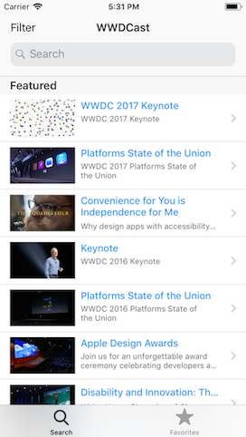
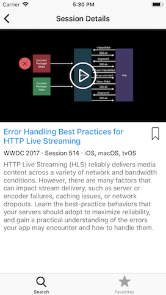
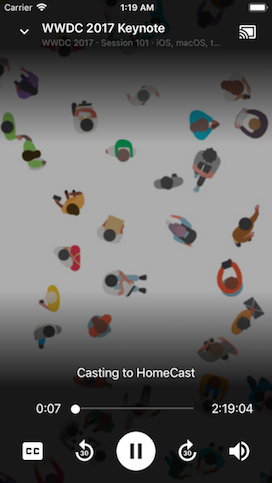

# WWDCast


[](https://www.bitrise.io/app/08e3f4df4a3bb96a)

The unofficial WWDC iOS application to watch WWDC videos and sessions on your ChromeCast.

If you would like to test the latest changes, you can join the **TestFlight** beta by sending your e-mail address to [@sgl0v](mailto:maxscheglov@gmail.com).

## Features

You can watch WWDC videos on your ChromeCast. Just select a video, click the play and choose your device from the list. The app becomes the remote control to play, pause, seek, rewind, stop, and otherwise control the media.





## Dependencies

* Xcode 9.3 or later
* iOS 10 or later
* [Carthage](https://github.com/Carthage/Carthage) (`brew install carthage`)
* [Swiftlint](https://github.com/realm/SwiftLint) (`brew install swiftlint`)

## Building the app

Just run these instructions:

```sh
git clone https://github.com/sgl0v/WWDCast.git
cd WWDCast
carthage update --platform iOS
```

Eventually you should open the `WWDCast.xcworkspace` and build/run WWDCast.

## Other projects

- [WWDC app for iOS](https://appsto.re/br/w0kkM.i). Apple's official WWDC app for iOS where you can see the schedule, maps, videos and news.

- [WWDC app for macOS](https://wwdc.io). The unofficial WWDC app for macOS.

- [Parties for WWDC](https://appsto.re/br/InPC0.i). An aggregator of developer parties happening in San Jose mostly exclusively for attendees of WWDC.

- [ASCIIwwdc](http://asciiwwdc.com/). Searchable full-text transcripts of WWDC sessions.

## License

WWDCast is licensed under MIT. However, **please do not ship this app** under your own account, paid or free.

## Contributing

Your ideas for improving this app are greatly appreciated. The best way to contribute is by submitting a pull request. I'll do my best to respond to you as soon as possible. You can also submit a new Github issue if you find bugs or have questions.
